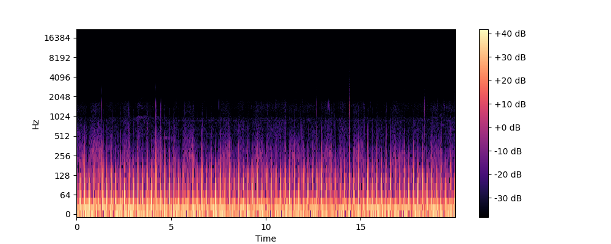

##  Project Overview: "PulseLink"
**Goal**: Distant lung sound analysis using .wav audio files --STFT-→ Spectrogram → CNN Model Prediction → React UI. Can Diagnose common lung diseases including: URTI, COPD, Asthma, Bronchiectasis, and LRTI. 

**Stack**: ReSpeaker Mic Array V2.0 (external DOA microphone) + FastAPI + MongoDB + React.js + Three.js + Blender + TensorFlow + Audio Processing Algorithm (STFT- Short-Time Fourier Transform)

**Team**: 
- Valentin (main dev), Amy Le (UX), Hanah Dau (Blender)
---

### Notes from developer code adaptations

- This project reuses some **UI components** (React buttons, Button CSS animations and styling, and transparent card styles) from my previous personal React project as boilerplate. 

- All core functionality, backend logic, MQTT setups, Spectrogram conversion, Microphone (ReSpeaker Mic) control etc. and core features for PulseLink were designed and built during this hackathon. Except for the algorithm pipeline/ web architecture was thought and planned beforehand in 2 weeks on paper notes and whiteboard.

## UI DEMO
REACT UI DEMO:


Example Spectrogram converted from audio using STFT:


---
## Quick Architecture
```
Mic (ReSpeaker Mic v2.0) → MQTT Broker --> FastAPI API → STFT Processing → MongoDB → 
TensorFlow → CNN Prediction → React Dashboard
```

**Training Pipeline**:
- Find lung sound dataset[Respiratory Sound Database](https://bhichallenge.med.auth.gr/ICBHI_2017_Challenge)
- Implement data preprocessing (Python scripts)
- Train CNN model with validation split (Tensorflow) code adapted from [architgajpal/respiratory_disease_classification](https://github.com/architgajpal/respiratory_disease_classification) (fixed due to deprecation).

**Tasks**:
- [ ] Implement STFT algorithm
- [ ] Create spectrogram generation function
- [ ] Build and train CNN model >= 80% Accuracy
- [ ] Model evaluation and optimization

---
## Starting the WebApp
**Locating the right directory**
```
cd frontend/src
```
**Starting**
```
npm install
npm start
```

## Backend setup
**1.	Activate the virtual environment**

Navigate to the backend folder and activate the .venv:

Mac/Linux:
```
cd backend
source .venv/bin/activate
```

Windows (PowerShell):
```
cd backend
.venv\Scripts\Activate.ps1
```
**2.	Install dependencies**
```
pip install -r requirements.txt
```

**3. Run the backend server**
```
uvicorn main:app --reload
```

Once running, you can visit:
```
http://127.0.0.1:8000
```
